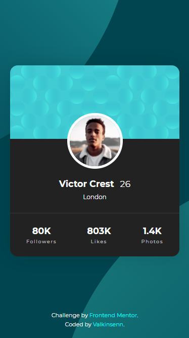
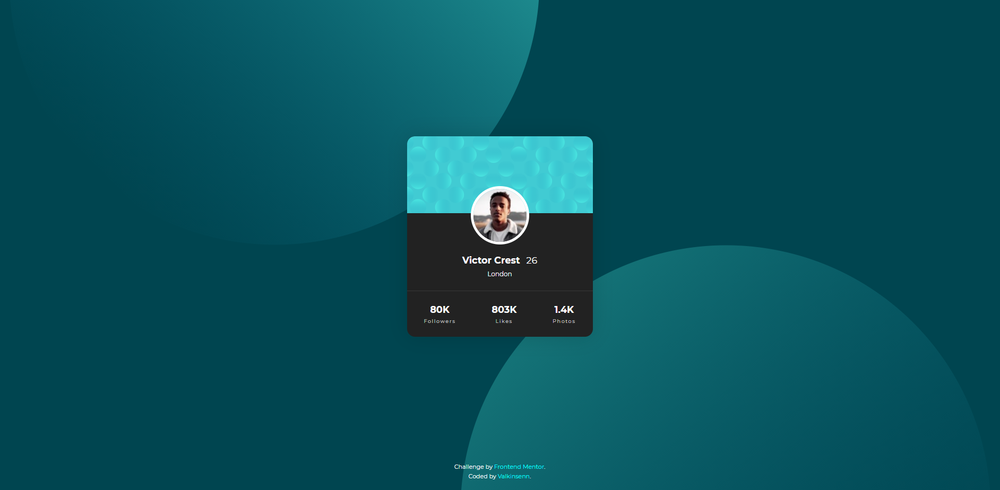

# Frontend Mentor: Profile card component solution

Greetings, everyone! This is my solution to the [Profile card component challenge on Frontend Mentor](https://www.frontendmentor.io/challenges/profile-card-component-cfArpWshJ).

## Table of contents

- [Overview](#overview)
  - [The challenge](#the-challenge)
  - [Screenshots](#screenshots)
  - [Links](#links)
- [My process](#my-process)
  - [Built with](#built-with)
  - [What I learned](#what-i-learned)
  - [Continued development](#continued-development)
  - [Useful resources](#useful-resources)
- [Author](#author)

## Overview

### The challenge

- Build out a mobile-first design that translates easily back and forth between mobile and desktop displays.

### Screenshots

#### Mobile Screenshot:



As you can see, I went off-script a bit and opted for a dark theme as it's a bit easier on the eyes. (It's also more or less my personal stamp on the project, too. :P )

#### Desktop Screenshot:



Here, the main profile box is the same, but it's a bit larger in width on larger displays.

### Links

- Live Site URL: [The end result of the project](https://valkinsenn.github.io/frontend-mentor--profile-card-component-challenge/).

## My process

### Built with

- HTML5
- A mobile-first workflow
- Flexbox
- Custom CSS through SASS

### What I learned

- When setting up a page content box to place all the page's elements in, if Flexbox's direction is set to "column," and justify-content is set to center, the center profile card will push everything else to the edges if its margins are set to "auto." That helped to push the attribution box to the bottom of the page on the screen, no matter what it is.

To see how you can add code snippets, see below:

```html
<!-- For the shapes in the background. This is what makes the magic happen back there. -->
<div class="bg-shapes">
  
  
</div>
```

```css
/* BG Shapes (this styles the above HTML) */

.bg-shapes {
  align-items: center;
  display: flex;
  height: 100vh;
  position: fixed;
  justify-content: center;
  top: 0;
  width: 100vw;
}

.bg-img-bottom,
.bg-img-top {
  height: 1000px;
  width: 1000px;
  z-index: 1;
}

.bg-img-bottom {
  transform: translateY(50%) translateX(-75px);
}

.bg-img-top {
  transform: translateY(-50%) translateX(75px);
}
```

### Continued development

I'd like to work a bit more on 3D stuff as I'm still getting used to the idea of making stuff 3D and working with it. Also, I really need to get comfortable with fetching data from backends, too.

### Useful resources

- [MDN | Aligning Items in a Flex Container](https://developer.mozilla.org/en-US/docs/Web/CSS/CSS_Flexible_Box_Layout/Aligning_Items_in_a_Flex_Container) - Sometimes, it helps to go back and have a look at how to properly center stuff in a Flexbox container.
- [Scrimba | The Responsive Web Design Bootcamp](https://scrimba.com/learn/responsive) - Where I learned about responsive web design in the first place, from the king of CSS himself, Kevin Powell.

## Author

- Website - (I don't have a website yet - I'm working on it!!!)
- Frontend Mentor - [@valkinsenn](https://www.frontendmentor.io/profile/yourusername)
- Twitter - [@valkinsenn](https://www.twitter.com/valkinsenn)
